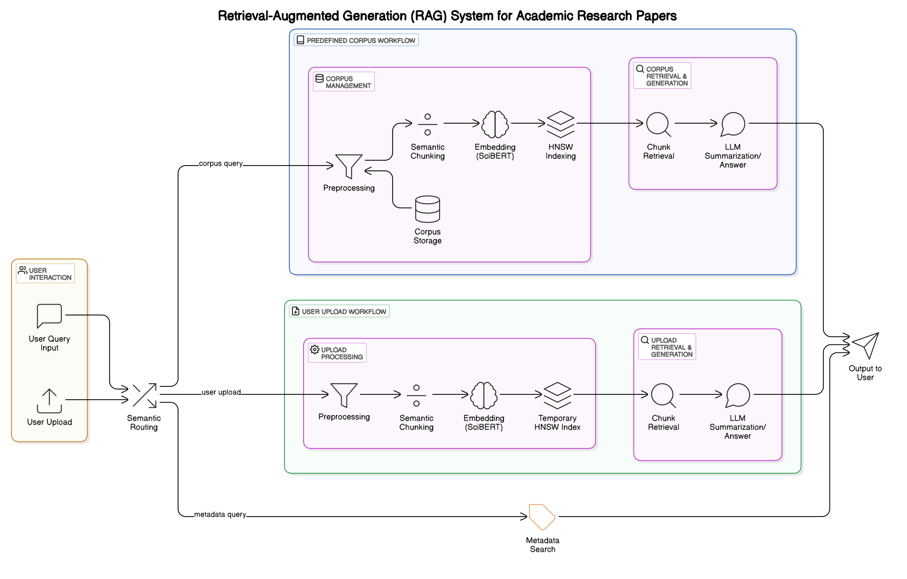

# Retrieval-Augmented Generation (RAG) for Research Papers

This project implements a **Retrieval-Augmented Generation (RAG)** system that is designed to search, summarize, and extract insights from academic research papers. It allows users to query a predefined corpus of research papers or upload their own papers for real-time processing, embedding, and retrieval. The system provides two modes:

- **Predefined Corpus Mode**: Processes a pre-existing dataset of academic papers.
- **User-Provided Papers Mode**: Allows users to upload their own papers for processing on-the-fly.

This system integrates document preprocessing, semantic chunking, embedding generation using **SciBERT**, and efficient similarity search with **FAISS HNSW**. It also leverages **semantic routing** to efficiently handle both content-based and metadata-based queries.

---




---


## Installation

1. **Clone the Repository**:

   ```bash
   pip install -r requirements.txt
   ```

   For running by uploading own pdf

   ```bash
   cd pdf_folder
   python main.py
   ```

   For running from corpus
      ```bash
   cd pdf_folder
   python main.py
   ```
      
